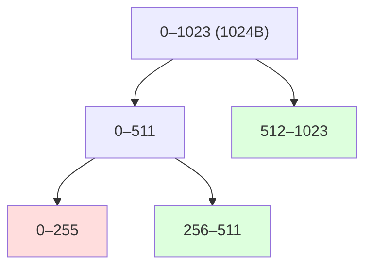

# バディシステムとスラブアロケータ

この章では、構造化されたヒープ設計の古典を 2 つ学ぶ。
分割と併合を 2 の冪に制限することで管理を劇的に単純化する
**バディシステム**と、「同じ型のオブジェクトを同じ場所に敷き詰める」
ことを徹底した**スラブアロケータ**である。
どちらも OS カーネルのメモリ管理で育った技術だが、
発想はユーザ空間のアロケータにも言語処理系のヒープにも深く浸透している。

## バディシステム — XOR が導く相棒

[バディシステム](#index:バディシステム)（buddy system）は 1965 年に
Knowlton が発表した割り当て法で[](#cite:knowlton1965)、
Knuth の教科書[](#cite:knuth1997)で広く知られるようになった。
アイデアはこうだ。

- ヒープ全体を 2 の冪のサイズ（たとえば $2^{20}$ バイト）とする。
- 要求は 2 の冪に切り上げる。$2^k$ バイトのブロックがなければ、
  $2^{k+1}$ のブロックを**半分に割って**作る。割った 2 つを互いの
  **バディ**（buddy; 相棒）と呼ぶ。
- 解放時、自分のバディも空きなら**再結合**して $2^{k+1}$ に戻す。
  これを再帰的に繰り返す。

この方式の美点は、バディのアドレスが**計算だけで**求まることだ。
サイズ $2^k$ のブロック（先頭オフセット `addr`）のバディは

```math
\mathrm{buddy}(addr, k) = addr \oplus 2^k
```

つまり `addr XOR (1 << k)` である。境界タグのようにメモリを読む必要すらない。
分割の系譜は完全 2 分木をなし、併合相手は木上の兄弟に限られる。



図は 1024 バイトのヒープで 256 バイトを 1 つ確保した状態である
（赤が使用中、緑が空き）。256–511 が空いても、その併合相手は
木上の兄弟 0–255 だけであり、たとえば 384–639 という
「木をまたぐ」領域は決して 1 ブロックにならない。

## Ruby でバディアロケータを書く

オーダー $k$（サイズ $2^k$）ごとの空きリストを持つ、教科書どおりの実装である。

```ruby
class BuddyAllocator
  def initialize(total_order)            # ヒープ全体 = 2**total_order バイト
    @max = total_order
    @free = Array.new(@max + 1) { [] }   # @free[k] = オーダー k の空きオフセット列
    @free[@max] << 0
    @order = {}                          # 使用中: オフセット => オーダー
  end

  def malloc(size)
    k = [Math.log2(size).ceil, 0].max    # 2 の冪へ切り上げ
    j = (k..@max).find { |o| !@free[o].empty? } or return nil
    addr = @free[j].shift
    while j > k                          # 大きすぎる間、半分に割る
      j -= 1
      @free[j] << (addr ^ (1 << j))      # 後ろ半分（バディ）を空きに登録
    end
    @order[addr] = k
    addr
  end

  def free(addr)
    k = @order.delete(addr) or raise "double free"
    while k < @max && @free[k].delete(addr ^ (1 << k))  # バディが空きなら
      addr &= ~(1 << k)                  # 結合後の先頭（小さい方のアドレス）
      k += 1                             # 1 つ上のオーダーへ
    end
    @free[k] << addr
  end

  def dump = (0..@max).map { |k| [1 << k, @free[k].sort] }.reject { |_, v| v.empty? }
end
```

`free` の `while` がバディシステムの心臓部だ。
`@free[k].delete(buddy)` は「バディが空きリストにあれば外して真を返す」ので、
**見つかる限り再帰的に上のオーダーへ結合**していく。動かしてみよう。

```ruby
b = BuddyAllocator.new(10)        # 1024 バイトのヒープ
x = b.malloc(200)                 # 256 バイトに切り上げ => 0
y = b.malloc(100)                 # 128 バイトに切り上げ => 256
p b.dump                          # => [[128, [384]], [512, [512]]]
b.free(x)
p b.dump                          # => [[128, [384]], [256, [0]], [512, [512]]]
b.free(y)                         # 384 と併合 → 256 と併合 → 512 と併合
p b.dump                          # => [[1024, [0]]]
```

最後の `free(y)` で、128 → 256 → 512 → 1024 と**連鎖併合**が起き、
ヒープが完全に元どおりになる。境界タグ法の併合が「隣を見る」だけなのに対し、
バディは「割った通りに畳む」ので、断片の位置が必ず揃う。

利点をまとめると、(1) 併合相手の判定が XOR 1 回、
(2) すべてのブロックサイズ・位置が揃うので管理構造が単純、
(3) 最悪でも $O(\log n)$ ステップ、である。
代償は**内部断片化**だ。サイズを 2 の冪に切り上げるので、
最悪 50% 弱（257 バイトの要求に 512 バイト）、
シミュレーション研究では平均でも 3 割前後の無駄が観察されている
[](#cite:peterson1977)。切り上げを緩和するため、
フィボナッチ数列をブロックサイズに使う**フィボナッチバディ**や
**重み付きバディ**といった変種も研究された[](#cite:peterson1977)。

## カーネルの中のバディ — Linux ページアロケータ

バディシステムの最大の現役ユーザは Linux カーネルである。
物理メモリの**ページ（4 KiB）の割り当て**は、オーダー 0（1 ページ）から
オーダー 10（1024 ページ = 4 MiB）までのバディシステムで管理される。
`/proc/buddyinfo` を見ると、いままさに動いているバディの空きリストが
オーダー別に並んでいる。

```console
$ cat /proc/buddyinfo
Node 0, zone   Normal   1046   1120    802    538    278    127     49     17      5      2      1
```

左からオーダー 0, 1, 2, ... の空きブロック数だ。
ページ単位なら内部断片化（最悪 2 倍）も「要求は元々ページの整数倍」
なので痛みが小さく、バディの単純さ・併合の強さが活きる。
ユーザ空間のアロケータが `mmap` でページをもらうとき、
その裏ではこのバディが動いている——本書の登場人物は二層構造になっているわけだ。
なお、連続した高オーダーブロックの枯渇（ヒュージページが取れない問題）は
カーネル側の断片化問題として現在も研究が続いている
（[局所性の章](locality.md)で再訪する）。

## スラブアロケータ — 「型」ごとの在庫棚

もう一つの古典が、Bonwick が Solaris カーネルのために設計した
[スラブアロケータ](#index:スラブアロケータ)（slab allocator）である
[](#cite:bonwick1994)。出発点の観察はこうだ：
カーネル（や言語処理系）は、**同じ型のオブジェクトを大量に確保・解放し続ける**。
inode、プロセス構造体、ネットワークバッファ……。
ならば「汎用の malloc」を毎回通すのは無駄で、
**型ごとに専用のキャッシュ**を作ればよい。

- 型ごとに **cache** を作る（例: `inode_cache`、オブジェクトサイズ固定）。
- cache はページ数枚ぶんの連続領域 **slab** を OS から取得し、
  オブジェクトサイズで敷き詰める。slab 内の空きは単純なフリーリストで持つ。
- slab 内の全オブジェクトが空きになったら、slab ごと OS に返せる。

これは前章の simple segregated storage を「サイズ別」からさらに
「型別」へ進めたものだ。Bonwick の設計には、さらに 2 つの洞察がある。

第一に、**コンストラクタ済みの状態を保つ**こと。
オブジェクトには確保のたびに同じ初期化（ロックの初期化、リストの連結など）が
施される。スラブは解放されたオブジェクトを「初期化済みのまま」在庫に置き、
次の確保で初期化を省く。`malloc` が中身を不定とするのと対照的に、
**型を知っているからこそ**できる最適化である。

第二に、のちの拡張 magazine 層[](#cite:bonwick2001)で導入された
**CPU ごとの在庫**。各 CPU は magazine（弾倉）と呼ばれる固定本数の
オブジェクト束を手元に持ち、確保・解放はロックなしで弾倉から行う。
弾倉が空（または満杯）になったときだけ、ロックを取って中央の在庫
（depot）と弾倉ごと交換する。これは現代のスレッドキャッシュ
（[マルチスレッドの章](multithread.md)）の原型であり、
「在庫の単位ごと交換する」発想は TCMalloc の transfer cache に受け継がれている。

Linux カーネルも Solaris に倣ってスラブ系アロケータ（現在の実装は SLUB）を持ち、
`kmalloc` はサイズクラス別の汎用 cache、`kmem_cache_create` は型別 cache を提供する。
`/proc/slabinfo` で型別の在庫が観察できるのは、`/proc/buddyinfo` と好対照だ。

## 言語処理系のヒープはスラブでできている

スラブの「同じ型・同じサイズを敷き詰め、ページ単位で回収する」設計は、
GC を持つ言語処理系のヒープ設計そのものである。

CRuby のオブジェクトヒープを Ruby 自身で観察してみよう。
オブジェクト ID の元になるアドレスを並べると、敷き詰めの規則性が見える。

```ruby
# 大量のオブジェクトのアドレスを集め、隣どうしの間隔を集計する
# （ObjectSpace.dump の出力に実アドレスが含まれることを利用した、実装依存の遊び）
require "objspace"
objs  = Array.new(1000) { Object.new }
addrs = objs.map { |o| ObjectSpace.dump(o)[/"address":"0x(\h+)"/, 1].to_i(16) }
deltas = addrs.sort.each_cons(2).map { |a, b| b - a }
p deltas.tally.sort_by { |_, c| -c }.first(3)
# => [[40, 375], [80, 257], [120, 139]]   (環境により数は変わる)

p GC::INTERNAL_CONSTANTS.slice(:BASE_SLOT_SIZE, :HEAP_PAGE_SIZE)
# => {BASE_SLOT_SIZE: 40, HEAP_PAGE_SIZE: 65536}
```

アドレス間隔がすべて **40 の倍数**になる（確保順は前後するので、
間隔 80 や 120 は「間のスロットが別のオブジェクトに使われた」跡である）。
これは CRuby の heap page（このビルドでは 64 KiB）に 40 バイトスロットが
グリッド状に敷き詰められているからで、前章の size pool と合わせれば
「サイズクラス別のスラブ」という構図がそのまま見える。
GC のスイープでページ内の全スロットが空けば、ページごと
OS へ返却される（`GC.stat(:heap_eden_pages)` などで観察できる）。
スラブを学んでから処理系の GC ソースを読むと、
見慣れた部品の組み合わせに見えるはずだ。

> [!TIP]
> jemalloc は小サイズ用の領域をそのまま「slab」と呼び、
> mimalloc は同役の構造を「page」と呼ぶ。名前は違えど、
> 「固定サイズを敷き詰めた領域＋領域単位の回収」という設計は共通である。
> [第 IV 部](part-libraries.md)では、この共通語彙で各実装を読み比べる。

## バディとスラブの使い分け

2 つの古典を並べると、役割分担がはっきりする。

| | バディシステム | スラブアロケータ |
|---|---|---|
| 得意なサイズ | ページ〜数 MiB の粗い割り当て | 数十〜数百バイトの固定サイズ |
| 内部断片化 | 大きい（2 の冪へ切り上げ） | ほぼゼロ（サイズ固定） |
| 併合 | XOR で強力・自動 | しない（slab 単位で回収） |
| 典型的な使い手 | OS の物理ページ管理 | カーネルオブジェクト・言語処理系 |

実際、Solaris も Linux も「バディ（ページ）の上にスラブ（オブジェクト）」
という二層を採る。ユーザ空間の現代アロケータも、
「OS からの粗い調達（バディに相当する層は mmap とアロケータ内の
ページ管理）の上に、サイズクラス別の敷き詰め領域」という同型の構造を持つ。
第 II 部で学んだ部品はこれで出揃った。
[次の部](part-advanced.md)では、これらの部品を前提に、
断片化・並行性・セキュリティといった**横断的な問題**へ進む。
