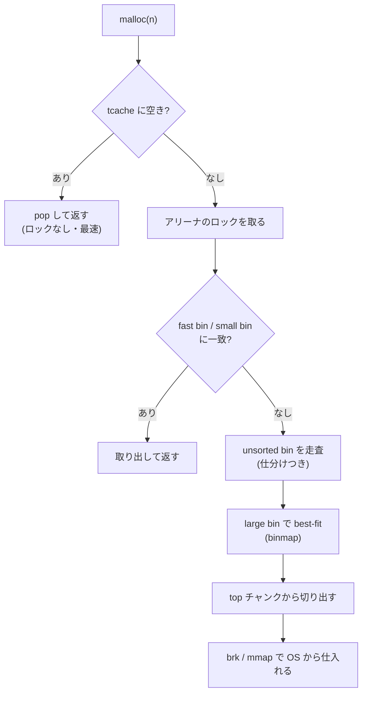

# glibc malloc — あなたの手元で動く実装

Linux で C プログラムをコンパイルして `malloc` を呼ぶと、
たいていの場合この **glibc malloc**（実装名 **ptmalloc2**）が動く。
[ヒープを覗く章](inside-malloc.md)で観察したのも、Ruby の
「`MALLOC_ARENA_MAX=2` でメモリが減る」のも、すべてこの実装の話だ。
ptmalloc2 は、前章の [dlmalloc](dlmalloc.md) に
**マルチスレッド対応（アリーナ）**と**スレッドキャッシュ（tcache）**を
足したものである。だから本章は「dlmalloc に何を足したか」を軸に読むのが速い。

## アリーナ — 並列性のための複数ヒープ

dlmalloc は単一ヒープ＋単一ロックで、
[マルチスレッドの章](multithread.md)で見たロック直列化に陥る。
ptmalloc2 の答えが[アリーナ](#index:アリーナ)（arena）である。
アリーナとは「独立したヒープ＋専用ロック」の一式で、
スレッドを別々のアリーナに振り分けて競合を減らす。

- 最初のアリーナ（**メインアリーナ**）は `brk` ベースのヒープを使う。
- スレッドが `malloc` 時にメインアリーナのロックを取れなかったら、
  別の（または新しい）**非メインアリーナ**を割り当てて使う。
  非メインアリーナは `mmap` で確保した独立領域上に作られる。
- 各スレッドは一度結びついたアリーナを使い続ける（thread-local に記憶）。

アリーナ数には上限があり、既定で **CPU コア数 × 8**（64 ビット）である。
ここで有名な `MALLOC_ARENA_MAX` 環境変数が効く。
アリーナを増やすと並列性は上がるが、**各アリーナが独立に在庫を抱える**ので、
[マルチスレッドの章](multithread.md)の blowup と同種のメモリ増加が起きる。

> [!IMPORTANT]
> 「Rails アプリで `MALLOC_ARENA_MAX=2` を設定するとメモリ使用量が減る」
> という定番の対処の正体がこれだ。多数のスレッドがアリーナを増やし、
> それぞれが断片化した在庫を持つことで RSS が膨らむ。
> アリーナ数を 2 に絞れば在庫の総量が減り、メモリが安定する——
> 並列性能と引き換えにメモリを節約する調整である。
> 同じ理由で `--with-jemalloc` 版 Ruby も使われる（[jemalloc の章](jemalloc.md)）。

## tcache — スレッドごとの速いパス

ptmalloc2 はもうひとつ、glibc 2.26（2017 年）で大きな改良を入れた。
[tcache](#index:tcache)（per-thread cache）である。
[マルチスレッドの章](multithread.md)のスレッドキャッシュの実装で、
アリーナのロックすら取らずに済む最速パスを提供する。

- 各スレッドが、サイズクラス（64 種、最大 1032 バイト程度）ごとに
  小さな単方向リストを**ロックなし**で持つ。1 クラスあたり既定 7 個まで。
- `malloc` はまず tcache を見て、あれば pop して即返す。
  ここにヒットする限り、アリーナのロックも fast bin も触らない。
- `free` は、サイズが合えばまず tcache へ push する。
- tcache が一杯（7 個）なら、その先は従来の fast bin / アリーナへ回る。

tcache の導入で、glibc malloc のシングルスレッド・マルチスレッド両方の
性能が大きく向上した。[ヒープを覗く章](inside-malloc.md)で
「2 個目の `malloc(1000)` はシステムコールを起こさない」と見たが、
小さいサイズなら今や「2 個目はロックすら取らない」のである。

tcache の在庫数や上限サイズは `mallopt` / 環境変数
（`glibc.malloc.tcache_count` など、`GLIBC_TUNABLES` 経由）で調整できる。

## 全体像 — 確保が通る道

dlmalloc の指定適合（[dlmalloc の章](dlmalloc.md)）に
tcache とアリーナが加わった、ptmalloc2 の `malloc` の流れはこうなる。

上から順に試し、ヒットしたところで止まる。
大多数の確保は最上段の tcache で終わる。
この「速いパスを上に、正確なパスを下に」という多段構造は、
ptmalloc2 に限らず本書のすべてのアロケータに共通する骨格である。

## 観察と診断

glibc malloc の内部構造をさらに深く追うなら、公式 wiki の Malloc Internals 解説
が最も信頼できる一次資料である。
ここでは、その内部を外から観察するための API を整理しておく
（[ヒープを覗く章](inside-malloc.md)・[付録](tools.md)でも使う道具だ）。

- `malloc_stats()`: アリーナごとの確保量・空き量を stderr に表示。
- `malloc_info(0, stream)`: より詳しい統計を XML で出力。
  アリーナ数、bin ごとの空き、mmap 領域などが分かる。
- `mallinfo2()`: 集計値を構造体で返す（古い `mallinfo()` は
  32 ビットあふれの問題があり、2.33+ の `mallinfo2()` が推奨）。
- 環境変数 `MALLOC_CHECK_=3`: 二重解放やオーバーフローを
  検出したら中断する簡易チェックモード（本番では使わない）。
- `M_PERTURB`（`mallopt`）: 確保領域を既知のバイトで埋め、
  「初期化忘れ」を顕在化させる。

「`free` したのに RSS が減らない」を診断するときは、
`malloc_stats()` で「アリーナは空いている（in use が小さい）が
system bytes が大きい」状態を確認し、`malloc_trim(0)` で
末尾返却を試みる、という手順になる
（[ヒープを覗く章](inside-malloc.md)の実験 3 を思い出してほしい）。

## セキュリティ強化の歴史

glibc malloc は、[セキュリティの章](security.md)で見たヒープ攻撃に対して、
長年かけて検査を足してきた。代表的なものを挙げる。

- **チャンクサイズの健全性検査**: `free` 時に「次のチャンクのサイズが
  妥当か」「アラインメントが合っているか」を確認し、
  壊れていれば `malloc(): corrupted ...` で中断する。
- **fast bin / tcache の二重解放検査**: 同じチャンクが
  リスト先頭に二度入るのを検出する（tcache には専用の
  `key` フィールドがあり、解放済みマークに使う）。
- **unlink の検査**: 双方向リストから外すとき
  `fd->bk == p && bk->fd == p` を確認し、古典的な unlink 攻撃を防ぐ。
- **safe-linking**（glibc 2.32+）: fast bin / tcache の
  単方向ポインタを「アドレスの上位ビットと XOR」して格納する。
  ポインタを生で書き換えられても、復号で破綻するようにした緩和策である。

これらは攻撃を完全には防げないが、攻撃の難度を上げる
「多層防御」の積み重ねだ。glibc malloc は速度最優先の汎用実装なので、
[セキュリティの章](security.md)の DieHarder や hardened_malloc のような
**強い**防御は持たない。強い保証が要るなら専用アロケータに差し替える、
という棲み分けになっている（[その他のアロケータの章](other-allocators.md)）。

## まとめ

glibc malloc（ptmalloc2）は、[dlmalloc](dlmalloc.md) の
チャンク・bin・指定適合という土台に、
**アリーナ**（複数ヒープでロック競合を分散）と
**tcache**（スレッドごとのロックなし速いパス）を足した実装である。
`MALLOC_ARENA_MAX` の挙動も、`free` 後に RSS が減らない現象も、
この設計から説明できる。汎用性と互換性を最優先するため
セキュリティ強化は緩和策の積み重ねにとどまる。
次章では、同じ問題を「最初からマルチスレッド前提」で設計し直した
jemalloc を見る。
