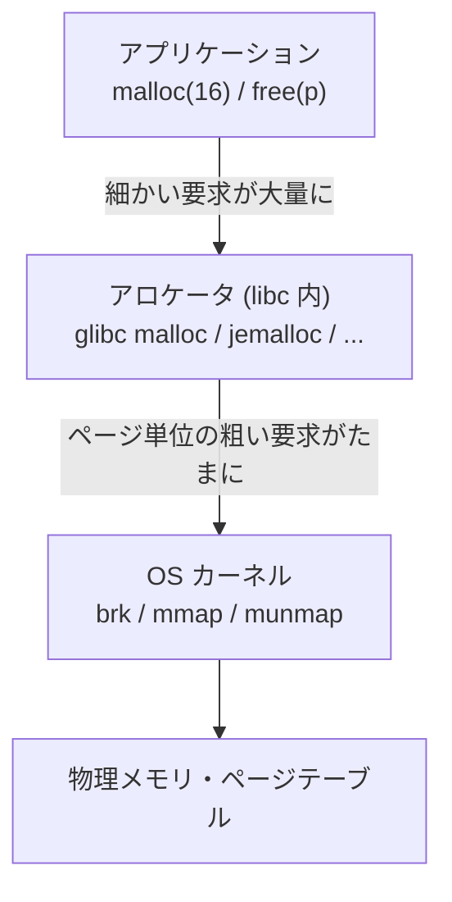

# なぜ malloc を学ぶのか

この章では、本書全体の見取り図を描く。`malloc` とは何者で、なぜそれが
「プログラミング言語処理系を学ぶ人」にとって重要なのか。そして、
動的メモリ割り当てという問題が、なぜ 60 年経ってもまだ研究され続けているのか。

## プログラムが使う 3 種類のメモリ

C プログラム（に限らず、ほとんどのプログラム）が使うメモリは、
寿命の決まり方によって大きく 3 種類に分けられる。

1 つめは**静的領域**である。グローバル変数や `static` 変数が置かれる場所で、
プログラムの開始から終了までずっと存在する。サイズはコンパイル時に決まっていて、
実行中に増えも減りもしない。

2 つめは**スタック**である。関数のローカル変数や引数、戻りアドレスが置かれる。
関数を呼ぶと積まれ、関数から戻ると自動的に解放される。
「後から確保したものを先に解放する」（LIFO; Last-In First-Out）という
規律が常に守られるので、管理はスタックポインタを上下させるだけでよく、極めて高速だ。

3 つめが本書の主役、**ヒープ**である。
「関数を抜けても生き続けるデータ」「実行時までサイズが分からないデータ」は、
静的領域にもスタックにも置けない。たとえば、

- ファイルから読んだ行（長さは読むまで分からない）
- 要素数がユーザ入力で決まる配列
- 関数から返す連結リストや木構造

こうしたデータのための領域を、実行中に「好きなときに確保し、好きなときに解放できる」
仕組みが[動的メモリ割り当て](#index:動的メモリ割り当て)（dynamic memory allocation）であり、
C におけるそのインターフェースが `malloc` と `free` だ。

```c
#include <stdlib.h>
#include <string.h>

char *duplicate(const char *const src) {
    char *const p = malloc(strlen(src) + 1);  /* ヒープに確保 */
    if (p == NULL) return NULL;               /* 失敗もありうる */
    strcpy(p, src);
    return p;   /* 関数を抜けても p の指す先は生きている */
}
```

スタックと違い、ヒープ上のデータの寿命は呼び出し構造と無関係で、
**確保と解放の順序が任意**である。この「任意の順序」こそが、
本書で見ていくあらゆる難しさ——断片化、速度、スレッド競合——の根源になる。

## malloc は OS ではなく「ライブラリ」である

初学者が驚くポイントを最初に言ってしまおう。
**`malloc` はシステムコールではない**。`malloc` の実体は、
libc（C 標準ライブラリ）の中にある、ユーザ空間で動くただの関数である。

OS（カーネル）が提供するのは、`brk` や `mmap` といった、
**ページ**（page; 多くの環境で 4 KiB）単位の大きくて粗い割り当てだけだ
（詳しくは [OS とのインターフェースの章](os-interface.md)で見る）。
システムコールは呼び出しコストが高く、しかもページ単位でしか確保できない。
`malloc(16)` のたびにカーネルを呼んでいたら遅すぎるし、無駄も大きい。

そこで libc 内の `malloc` 実装——本書では**メモリアロケータ**
（memory allocator）あるいは単に**アロケータ**と呼ぶ——が、
OS から大きな塊をまとめて借り、それを切り分けて配り、
`free` で返ってきた断片を取りまとめて再利用する。
いわば OS という「卸売業者」とアプリケーションという「消費者」の間に立つ
「小売業者」である。



この構造から、本書の主題が見えてくる。アロケータの仕事とは

- **速く**: 1 回の `malloc`/`free` を数十 ns 程度で済ませたい。
- **無駄なく**: 切り分けの際の余りや、再利用できない隙間
  （[断片化](#index:断片化)、fragmentation）を最小にしたい。
- **行儀よく**: 使い終わったメモリは OS に返し、キャッシュや
  TLB（アドレス変換キャッシュ。[局所性の章](locality.md)で説明する）にも優しくありたい。

の 3 つを、**将来の確保・解放パターンを知らないまま**両立することだ。
この 3 つは互いに衝突する。だから設計の余地が無限にあり、
60 年経った今も毎年のように新しいアロケータと研究論文が出続けている。

## 言語処理系から見た malloc

本書の読者は言語処理系に興味があるはずなので、その視点も最初に示しておく。

Ruby や Python のような言語では、プログラマは `malloc` を直接呼ばない。
しかし処理系の内部は `malloc` だらけである。CRuby を例に取ると、

- オブジェクト本体（`RVALUE`）は GC が管理する専用ページに置かれるが、
  その**ページ自体**の確保や、長い文字列・大きな配列の**中身**は
  `malloc`（正確には集計機能つきのラッパ `xmalloc`）で確保される。
- `malloc` した量が閾値（`malloc_limit`）を超えると GC が起動する。
  つまり **GC のタイミングまで malloc が左右する**。
- Rails アプリのメモリ肥大の定番対策に「jemalloc に差し替える」
  「環境変数 `MALLOC_ARENA_MAX=2` を設定する」というものがあるが、
  これは glibc malloc のマルチスレッド設計（[マルチスレッドの章](multithread.md)と
  [glibc malloc の章](glibc-malloc.md)で詳しく見る）に起因する。

つまり、インタプリタや GC を書く人にとって、malloc は「下請けの黒箱」ではなく、
**性能とメモリ使用量を決める設計要素**である。
ガベージコレクション（GC）が「いつ・何を解放するか」を自動化する技術だとすれば、
malloc は「解放のタイミングは人間（や GC）が決めたあと、
**どこに置き、どう再利用するか**」を担う技術であり、両者は補完関係にある。

> [!NOTE]
> GC 自体のアルゴリズム（マーク＆スイープ、世代別 GC など）は本書の範囲外である。
> ただし、GC 処理系のヒープ設計（たとえば CRuby のオブジェクトページ）には
> 本書で学ぶスラブやサイズクラスの考え方がそのまま現れる。
> [バディとスラブの章](buddy-slab.md)で具体的に対応づける。

## 60 年の研究史をひとことで

動的メモリ割り当ての研究は 1960 年代に始まる。
バディシステムの最初の発表は 1965 年[](#cite:knowlton1965)、
first-fit や best-fit といった基本戦略の数理的解析は 1970 年代に
盛んに行われた[](#cite:robson1971)[](#cite:shore1975)[](#cite:bays1977)。
Knuth の『The Art of Computer Programming』第 1 巻[](#cite:knuth1997)には、
境界タグ法をはじめ、今のアロケータでも使われる技法がすでに整理されている。

1995 年には Wilson らによる 100 ページ超の記念碑的サーベイ[](#cite:wilson1995)が、
それまでの 30 年分の研究を「ポリシー（方針）とメカニズム（仕組み）の分離」という
視点で整理し直した。彼らの主張は痛烈で、
「多くの研究は非現実的なランダムな負荷で評価されており、
実プログラムでの挙動はほとんど分かっていない」というものだった。
続く 1998 年の論文[](#cite:johnstone1998)は、実プログラムで測れば
良い方針のアロケータの断片化はごくわずかだと示し、
「断片化問題は（実用上）解決済みか？」と題された。
この 2 本は本書でも繰り返し参照する。読みやすいので、ぜひ原文にあたってほしい。

2000 年代の主役はマルチスレッドである。マルチコア化とサーバアプリの大規模化で、
「スレッドが増えても遅くならない」ことが最重要課題になり、
Hoard[](#cite:berger2000) を皮切りに jemalloc[](#cite:evans2006) や
TCMalloc[](#cite:ghemawat2007) が生まれた。
2010 年代以降はセキュリティ（DieHarder[](#cite:novark2010) など）、
ヒュージページ対応[](#cite:hunter2021)、
機械学習の応用[](#cite:maas2020)、
データセンター規模での実測研究[](#cite:zhou2024)へと戦線が広がり、
2025 年にも新しいアロケータの提案が続いている[](#cite:li2025exgen)[](#cite:li2025speed)。
この流れは[第 III 部](part-advanced.md)で 1 トピック 1 章ずつ追いかける。

## 本書の歩き方

第 I 部はいわば「現象」の部である。まず [API の正確な仕様](api-basics.md)を確認し、
[OS とのインターフェース](os-interface.md)を学び、
[実際に動いている malloc を観察する](inside-malloc.md)。
ここまでで「malloc に何が求められているか」が体感できる。

第 II 部は「古典アルゴリズム」の部。教科書的な
[フリーリスト](free-list.md)、[サイズクラス](segregated-lists.md)、
[バディシステムとスラブ](buddy-slab.md)を、Ruby で書いた小さなシミュレータと
一緒に手を動かして理解する。

第 III 部は「研究」の部。断片化・並行性・局所性・セキュリティ・リアルタイム・
最新研究という 6 つのトピックを、それぞれ論文を引きながら掘り下げる。

第 IV 部は「実物」の部。歴史的に重要な dlmalloc から、
いまあなたの Linux マシンで動いている glibc malloc、
産業界の主力 jemalloc / TCMalloc、研究発の mimalloc まで、
1 つずつ設計を読み解く。第 II・III 部の概念が全部出てくる、いわば総合演習である。

> [!IMPORTANT]
> 本書のコード例は、C は Linux/x86-64 + glibc を、Ruby は CRuby 3.x/4.x を想定している。
> アロケータの実装詳細（しきい値や既定値）はバージョンで変わるので、
> 「考え方」を読み取り、正確な数値は手元の環境で確かめる癖をつけてほしい。
> 確かめ方そのものも[ヒープを覗く章](inside-malloc.md)と[付録のツール章](tools.md)で扱う。
