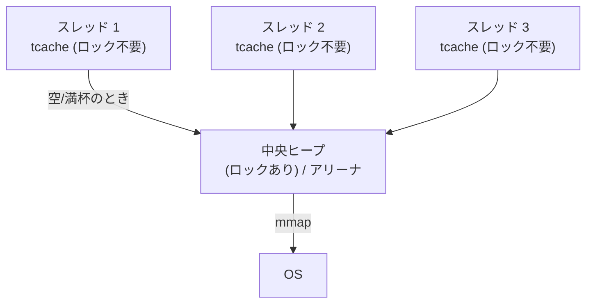

# マルチスレッド — スケーラビリティと blowup

2000 年代以降、アロケータ研究の主戦場はマルチコアになった。
「`malloc`/`free` をどれだけ速くできるか」よりも、
「**スレッドが増えても遅くならないか**」「スレッドごとに在庫を
持たせるとメモリが膨れないか」が問われるようになる。
この章では、ロック競合・偽共有・blowup という 3 つの落とし穴と、
それらを解く設計——アリーナ分割、スレッドキャッシュ、ロックフリー——を、
Hoard 以来の研究をたどりながら学ぶ。
ここは glibc malloc・jemalloc・TCMalloc・mimalloc（[第 IV 部](part-libraries.md)）の
設計を理解するための中核である。

## 素朴な解法とその限界 — 1 本の大きなロック

最も単純なマルチスレッド対応は、ヒープ全体を 1 本のロックで守ることだ。
`malloc`/`free` の入口でロックを取り、出口で放す。正しさは保証されるが、
**全スレッドが 1 本のロックに直列化される**。
コア数を増やしても `malloc` が増えれば増えるほど待ち行列が伸び、
スループットはむしろ下がる。マルチコアの恩恵がまったく出ない。

この「直列化」を避けるのが、マルチスレッドアロケータの第一目標である。
鍵は単純で、**スレッド（や CPU）ごとに別々の在庫を持たせ、
普段はその在庫だけで済ませてロックを避ける**ことだ。
ただし、これが次に説明する新しい問題を生む。

## 偽共有 — アロケータが性能バグを「配る」

[偽共有](#index:偽共有)（false sharing）は、マルチスレッドアロケータが
引き起こしうる、見えにくい性能問題である。

CPU のキャッシュは[キャッシュライン](#index:キャッシュライン)
（cache line; 多くは 64 バイト）単位で動く。
2 つのスレッドが**別々の変数**を更新していても、
それらが**同じキャッシュライン上**にあると、
ハードウェアのキャッシュ整合性プロトコルはラインごと奪い合わせる。
論理的には共有していないのに、物理的に共有しているせいで遅くなる——これが偽共有だ。

アロケータがこれにどう絡むか。スレッド A とスレッド B が
それぞれ `malloc(32)` した 2 つのブロックが、たまたま同じ 64 バイトラインに
同居したとする。A と B が自分のブロックを激しく更新すると、
ユーザは何も悪くないのに偽共有でスループットが落ちる。
**アロケータが配置を通じて性能バグを配ってしまう**わけだ。

Hoard は、この問題への明確な回答を設計目標に掲げた
最初のアロケータの一つである。基本方針は「**1 つのスーパーブロック
（連続領域）は 1 スレッドだけに配る**」。別スレッドのブロックが
同じラインに乗らないようにすれば、能動的に確保したオブジェクト間の
偽共有は構造的に防げる。

> [!WARNING]
> 偽共有は、確保したメモリを複数スレッドで分担して更新する設計
> （配列をスレッドで分割して並列処理する等）でも自分で作り込める。
> 対策は、スレッドごとのデータをキャッシュライン境界にアライン
> （`alignas(64)` や `posix_memalign(p, 64, ...)`）してパディングを入れること。
> アロケータ任せにせず、ホットなデータは明示的に分離するのが定石である。

## blowup — スレッドキャッシュが招くメモリ爆発

スレッドごとに在庫を持たせると、別の罠が口を開ける。
Berger らが **blowup** と名付けた現象だ。

たとえば「生産者スレッドが確保し、消費者スレッドが解放する」
プログラムを考える。素朴なスレッドキャッシュ実装では、
消費者が `free` したブロックは**消費者のローカル在庫**に積まれ、
生産者の在庫には戻らない。生産者は在庫が空なので OS から取り続け、
消費者の在庫は膨らむ一方。**解放しているのにメモリが際限なく増える**。

Berger らは blowup を「アロケータのメモリ使用量が、
理想的なアロケータの使用量に対してどれだけ膨らむかの比」として定式化し、
Hoard が blowup を**定数倍に抑える**ことを証明した。
仕組みは「スレッドのローカル在庫が一定割合を超えて空いたら、
スーパーブロックをグローバルヒープに返す」という返却規則である。
スレッドキャッシュを持つ後発のアロケータはすべて、
形は違えどこの「在庫の上限と吐き出し」規則を持っている。

「Rails アプリで `MALLOC_ARENA_MAX=2` を設定するとメモリが減る」
という有名な対処も、blowup 系の問題である。
glibc malloc はスレッドが増えると**アリーナ**（独立したヒープ。
最大でコア数の 8 倍まで）を増やし、各アリーナが在庫を抱える。
アリーナ数を絞れば、抱える在庫の総量が減る——
速度と引き換えにメモリを節約する調整だ
（詳しくは [glibc malloc の章](glibc-malloc.md)）。

## スレッドキャッシュという中心解

現代の主要アロケータに共通する解が、
[スレッドキャッシュ](#index:スレッドキャッシュ)（thread cache）である。
[スラブの章](buddy-slab.md)で見た Bonwick の magazine 層
 の直系で、構造はこうだ。

- 各スレッドが、サイズクラスごとに小さな在庫（数十個）を**ロックなし**で持つ。
- `malloc` はまず tcache を見る。あればそれを返す——**ロックもアトミック操作もなし**で
  数命令。これが大多数の確保のコストを決める。
- tcache が空なら、中央ヒープ（ロックあり、またはアリーナ）から
  **まとめて**補充する。1 回のロックで数十個取るので、ロックの回数が激減する。
- tcache が一定数を超えたら、超過分を中央へまとめて返す（blowup 防止）。

glibc は 2.26（2017 年）で **tcache** を導入し、これで一気に高速化した。
TCMalloc の名はそのまま **T**hread-**C**aching **Malloc** だし、
jemalloc の **tcache**、mimalloc のスレッドローカルヒープも同じ思想である。
細部（在庫数の上限、補充・返却の単位、サイズクラスとの対応）が
各実装の個性になっている。

## 遠隔解放 — 「別スレッドが free する」問題

スレッドキャッシュには根本的な難所がある。
**ブロックを確保したスレッドと、解放するスレッドが違う**場合だ
（先の生産者・消費者がまさにそれ）。解放スレッドは、
そのブロックが「どのスレッドのものか」を知らないと正しく返せない。

解き方は大きく 2 つある。

1 つは **mimalloc** の採る道で、各ブロックは
「所有するスレッドのヒープ（ページ）」に属し、
別スレッドが解放するときは**所有者のページの「遠隔解放リスト」へ
アトミックに push する**。所有者は自分の都合のよいときに
このリストを回収する。所有者側のローカル操作はアトミック命令すら不要にでき、
「速いパスを徹底的に軽くする」mimalloc の設計思想を象徴する。

もう 1 つは **snmalloc** が突き詰めた
**メッセージパッシング**である。解放を「所有スレッドへのメッセージ」とみなし、
バッチ化したメッセージキューで送る。生産者・消費者型の負荷
（片方が確保し片方が解放する）に特化して最適化されている。

どちらも「共有データをいかに触らずに済ませるか」という、
マルチスレッド設計の一般原則の現れである。

## ロックフリー割り当て

ロックそのものを使わない**ロックフリー**（lock-free）アロケータも研究された。
Michael の 2004 年の設計 は、
スーパーブロックの状態を CAS（compare-and-swap; 比較交換アトミック命令）で
更新し、どのスレッドも他スレッドの停止に妨げられず前進できることを保証する。
スレッドが任意の点で止まっても全体が固まらない（耐障害性・進行保証）のが
ロックフリーの売りだ。

ただし実用上は、ロックフリーよりも
「スレッドローカルでそもそも共有しない（tcache）＋たまの同期だけ軽く」
という方が、平均的には速くてシンプルなことが多い。
SuperMalloc は、巨大な仮想アドレス空間と
プリフェッチを活用しつつ、ホットパスはごく短いクリティカルセクションで
済ませる設計で高い性能を出しており、
「ロックフリーが常に最適とは限らない」ことを示している。
局所性を保ちつつスケールさせる方向の研究としては、スレッドとメモリ領域の対応づけで局所性と競合低減を両立する設計も早くから探られた。
Scalloc は、広大な仮想メモリと
「仮想スパン」によってサイズクラス間の在庫融通を柔軟にし、
スケーラビリティと低断片化の両立を狙った。

## 言語処理系とマルチスレッド malloc

言語処理系にとって、この章の話は他人事ではない。

CRuby は長らく GVL（Global VM Lock）で VM レベルの並列実行を
制限してきたが、**C 拡張や I/O は GVL の外で並列に動く**し、
それらは普通に `malloc`/`free` を呼ぶ。さらに Ractor（並列実行単位）や
将来の並列化では、複数ネイティブスレッドが同時にアロケータを叩く。
このため CRuby のメモリ挙動はアロケータのスレッド設計に強く影響され、
「jemalloc にすると Rails のメモリが減る／安定する」という経験則が生まれた。
これは jemalloc の方が glibc malloc より
**アリーナあたりの在庫（blowup）を抑えやすく、断片化が小さい**ためで、
本章と [glibc malloc の章](glibc-malloc.md)・[jemalloc の章](jemalloc.md)の
知識があれば理由まで説明できる。

> [!NOTE]
> マルチスレッド性能は測定が難しい。スレッド数・確保サイズ分布・
> 確保と解放を同じスレッドでするか（local）別スレッドでするか（remote）で
> 結果が激変する。アロケータのベンチマーク（後述の `mstress`、`larson`、
> `xmalloc-test` など）は、まさにこれらの軸を狙って作られている。
> 自分のアプリで測るときも、この 3 軸を意識すると罠を避けられる。

## まとめ

マルチスレッドアロケータの敵は、ロック競合・偽共有・blowup の 3 つである。
共通解はスレッドキャッシュ（Bonwick の magazine の子孫）で、
「普段はスレッドローカルでロックなし、たまにまとめて同期」する。
難所は遠隔解放（確保と別スレッドでの解放）で、mimalloc の遠隔解放リストや
snmalloc のメッセージパッシングがこれを解く。
ロックフリーも一つの道だが万能ではない。
次章では、視点をスレッドからハードウェア——キャッシュと TLB——へ移す。
