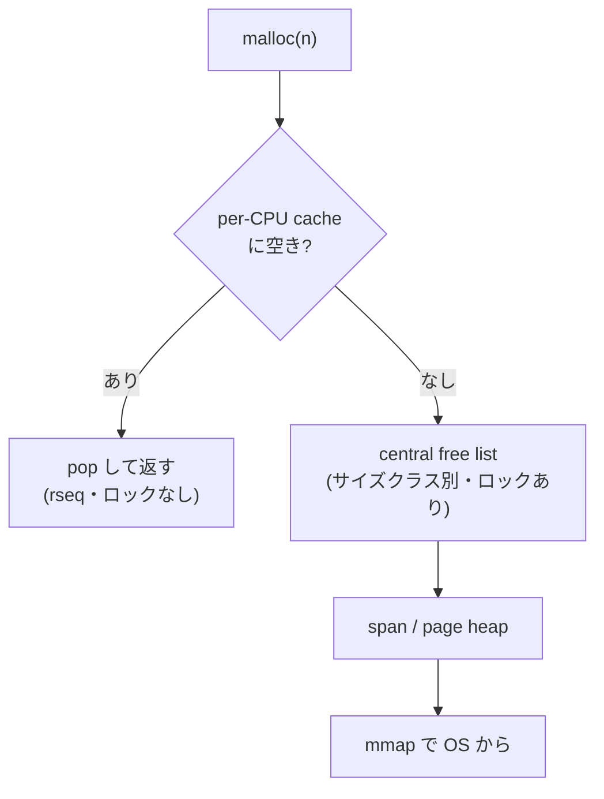

# TCMalloc — スレッドキャッシュの本家

**TCMalloc**（Thread-Caching Malloc）は、Google が開発し、
自社のほぼすべてのサーバで使っている本番アロケータである
[](#cite:ghemawat2007)。名前そのものが「スレッドキャッシュ」
([マルチスレッドの章](multithread.md)) を掲げており、
この分野の用語の本家でもある。
TCMalloc の価値は、単に速いことではなく、
**世界最大級のデータセンターで何年も実測・改良され続けている**ことだ。
ヒュージページ対応の TEMERAIRE[](#cite:hunter2021) も、
倉庫規模の特性分析[](#cite:zhou2024) も、すべて TCMalloc を舞台にしている。
本章では、その階層構造と、本番運用が生んだ設計を読む。

> [!NOTE]
> 歴史的には、TCMalloc は gperftools に含まれる版が広く知られていた
> [](#cite:ghemawat2007)。現在 Google が公開・開発しているのは、
> 本番フリートで使われているコードを反映した別リポジトリ版で、
> 設計ドキュメント[](#cite:tcmalloc2024) も整備されている。
> 本章は主に後者の設計を扱う。

## 三層キャッシュ — span・central・per-CPU

TCMalloc の骨格は、粒度の異なるキャッシュの階層である。
下から見ていこう。

最下層は **page heap** で、OS から `mmap` で取った連続ページを
**span**（連続ページの単位）として管理する。
大きな確保はここから直接満たす。span は[スラブの章](buddy-slab.md)の
slab に相当し、small サイズ用の span は単一サイズクラスの
オブジェクトで敷き詰められる。

「単一サイズクラスで敷き詰める」とは、要求サイズを段階的な代表値に丸め、同じ大きさの枠で span を埋めるということだ。TCMalloc 自体は本機に入っていないが、同じ「サイズクラスへ丸める」設計をとる jemalloc を `LD_PRELOAD` し、`malloc_usable_size` で丸め先を聞くと実態が見える。

```
$ LD_PRELOAD=/usr/lib/x86_64-linux-gnu/libjemalloc.so.2 ./a.out
malloc(   1) -> usable    8 B
malloc(   9) -> usable   16 B
malloc(  17) -> usable   32 B
malloc(  50) -> usable   64 B
malloc(  65) -> usable   80 B
malloc( 100) -> usable  112 B
malloc( 200) -> usable  224 B
malloc( 500) -> usable  512 B
malloc(1000) -> usable 1024 B
```

要求値が飛び飛びの代表値へ丸められ、その代表値ごとに span が敷き詰められる。TCMalloc も発想は同じで、小サイズ域は 8 バイト刻みなど細かい間隔のクラスを並べ、丸めによる内部断片化を抑える。代わりにクラス数は数十〜百ほどに増え、それぞれに span と per-CPU の在庫を持つ構造になる。

中間層が **central free list**（中央フリーリスト）で、
サイズクラスごとに span を束ね、各層へオブジェクトを供給する。
ここはロックで守られるが、触る頻度は低い。

最上層が高速パスで、TCMalloc はここを進化させてきた。
当初はスレッドごとの **thread cache** だったが、
現在の主力は **per-CPU cache** である。
**スレッド**ではなく**CPU コア**ごとにキャッシュを持つ方式で、
Linux の `rseq`（restartable sequences; 横取りされたら
やり直す軽量な CPU ローカル操作）を使い、
ロックもアトミック命令もほぼなしで確保・解放する。
スレッド数が多くてもキャッシュ数は CPU 数で頭打ちになるので、
[マルチスレッドの章](multithread.md)の blowup（在庫のかさみ）を
スレッドキャッシュより根本的に抑えられる。これが
「数千スレッドのサーバ」で効く。

この `rseq` は遠い話ではなく、手元の Linux + glibc 2.35 以降ですでに動いている。glibc は各スレッドの起動時に `rseq` を 1 度だけ登録し、いま動いている CPU 番号を TLS 上の領域（`__rseq_offset` で公開される）に書き込んでくれる。TCMalloc の per-CPU cache は、毎回これを読むだけで「このコア専用の在庫」をロックなしに選ぶ。同じ読み取りを再現してみよう。

```c
#define _GNU_SOURCE
#include <stdio.h>
#include <stddef.h>
#include <sched.h>
#include <pthread.h>
#include <unistd.h>
extern ptrdiff_t   __rseq_offset;   /* glibc が公開する rseq 領域の TLS オフセット */
extern unsigned int __rseq_size;
static unsigned rseq_cpu(void){     /* いま動いている CPU 番号をロックなしで読む */
  char *p = (char*)__builtin_thread_pointer() + __rseq_offset;
  return *(unsigned*)(p + 4);       /* offset 4 = cpu_id フィールド */
}
static void *worker(void *arg){
  long id = (long)arg, n = sysconf(_SC_NPROCESSORS_ONLN);
  cpu_set_t s; CPU_ZERO(&s); CPU_SET(id % n, &s);
  pthread_setaffinity_np(pthread_self(), sizeof(s), &s);  /* CPU に固定 */
  sched_yield();
  printf("thread %ld: rseq cpu_id=%u\n", id, rseq_cpu());
  return NULL;
}
int main(void){
  printf("__rseq_offset=%ld __rseq_size=%u\n", (long)__rseq_offset, __rseq_size);
  pthread_t t[4];
  for(long i=0;i<4;i++) pthread_create(&t[i],NULL,worker,(void*)i);
  for(int i=0;i<4;i++) pthread_join(t[i],NULL);
}
```

```
$ gcc -O2 demo.c -lpthread && ./a.out
__rseq_offset=2336 __rseq_size=32
thread 0: rseq cpu_id=0
thread 1: rseq cpu_id=1
thread 2: rseq cpu_id=2
thread 3: rseq cpu_id=3
```

`cpu_id` が固定した CPU と一致している。登録は `strace -f -e trace=rseq ./a.out` で見え、スレッドごとに `rseq(<addr>, 0x20, 0, 0x53053053) = 0` が 1 回ずつ呼ばれる（`0x20` = 32 バイト = 上の `__rseq_size`、`0x53053053` は横取り検出用の署名）。TCMalloc はこの `cpu_id` を添字にして per-CPU の空きリストへ飛ぶだけ。だからキャッシュ数は CPU 数で頭打ちになり、ロックもアトミック命令も要らない。



## ヒュージページが第一級市民 — TEMERAIRE

TCMalloc を現代的たらしめているのが、**ヒュージページを
設計の中心に据えた**ことである。[局所性の章](locality.md)で見た
TEMERAIRE[](#cite:hunter2021) は、この page heap を
ヒュージページ（2 MiB）対応に作り替えた研究だ。要点を再掲すると、

- メモリを**ヒュージページ単位**で管理し、確保はなるべく
  **すでに埋まっているヒュージページ**から行う。
  ページを満杯に近づけ、空きページを「完全に空」にしやすくする。
- 各ヒュージページの埋まり具合を追跡し、
  ほぼ空のものを優先して空け、OS へ返す（subrelease による部分返却）。

これにより、データセンター全体で RAM を節約しつつ
命令効率（IPC）を改善した。TLB ミス削減（[局所性の章](locality.md)）と
断片化抑制（[断片化の章](fragmentation.md)）を同時に狙う、
TCMalloc の現在地を象徴する設計である。

その上で Google は、本番ワークロードで TCMalloc を**実測**した
特性分析[](#cite:zhou2024)を 2024 年に発表した。
確保サイズ分布・寿命・断片化の内訳を倉庫規模で測り、
理論や合成ベンチマークでは見えない実態
（たとえば、ごく少数のサイズクラスが確保の大半を占めること、
断片化の主因がどこにあるか）を明らかにした。
[断片化の章](fragmentation.md)で述べた
「解決済み？→大規模・長時間では再び課題」という揺り戻しを、
データで裏づけた論文である。

## 観測 — MallocExtension とプロファイル

TCMalloc も観測機能が手厚い。`MallocExtension` インターフェースを通じて、
実行時に統計を取り、パラメータを変えられる。

- ヒープ統計（確保中・キャッシュ済み・page heap の各バイト数）の取得。
- per-CPU / per-thread キャッシュの最大サイズの調整。
- **ヒーププロファイル**: jemalloc の `prof` と同様、
  確保をコールスタックごとに集計し、`pprof` で可視化する。
  Google 製のメモリ調査はこのプロファイルが基盤になっている。
- メモリ解放の積極度（`background_release_rate` で OS へのページ返却レートを設定）
  などのランタイム制御。

C++ サーバが主な対象なので、`new`/`delete` 経由の確保も
そのまま捕捉される（[API の章](api-basics.md)で触れたとおり、
`new` は内部で malloc 相当を呼ぶ）。

## どんなときに TCMalloc を選ぶか

TCMalloc は「**多数スレッド・長時間稼働・C++ サーバ**」に
最も強い。per-CPU キャッシュとヒュージページ対応が、
まさにその環境のために設計されているからだ。
Google のような規模でなくても、高並列な C++ バックエンドでは
glibc malloc から TCMalloc に替えるだけで
スループットと RSS が改善することが多い。

一方、TCMalloc は内部でヒュージページや大きめの仮想空間を前提とするため、
メモリの小さい組み込みや、ごく単純な単一スレッドプログラムには
過剰なこともある（そうした用途には[リアルタイムの章](realtime.md)の
TLSF や、後述の musl の malloc、2025 年の ExGen-Malloc
[](#cite:li2025exgen) のような専用化が向く）。
アロケータ選びは、常に「自分のワークロードの形」次第である。

> [!TIP]
> jemalloc と TCMalloc はしばしば直接比較される。
> 大づかみには、jemalloc は「`MALLOC_CONF` での細かい調整と
> 移植性（FreeBSD 標準）」、TCMalloc は「per-CPU・ヒュージページ・
> Google 規模の実証」が強み、と覚えておくとよい。
> どちらも `LD_PRELOAD` で試せるので、自分のアプリで
> RSS と実行時間を実測して選ぶのが一番確かだ。

## まとめ

TCMalloc は、span・central free list・per-CPU cache という
三層のキャッシュ階層を持ち、`rseq` による per-CPU キャッシュで
多数スレッドでも blowup を抑える。
ヒュージページを第一級に扱う TEMERAIRE[](#cite:hunter2021) と、
倉庫規模の実測研究[](#cite:zhou2024) により、
データセンター時代のアロケータ設計を牽引している。
多数スレッド・長時間の C++ サーバで最も力を発揮する。
次章では、研究室発で「速いパスの軽さ」を突き詰めた
mimalloc を見る。
